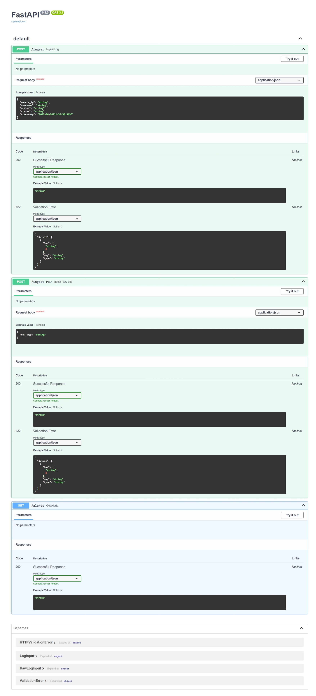
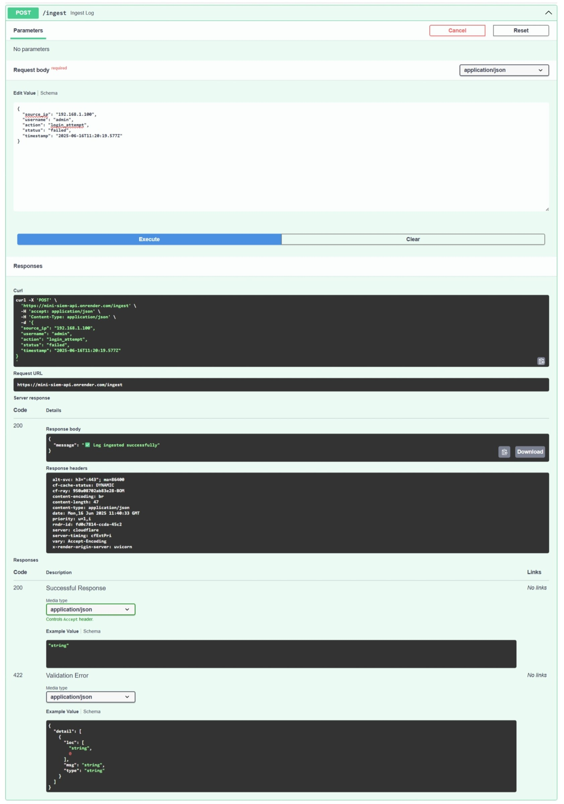
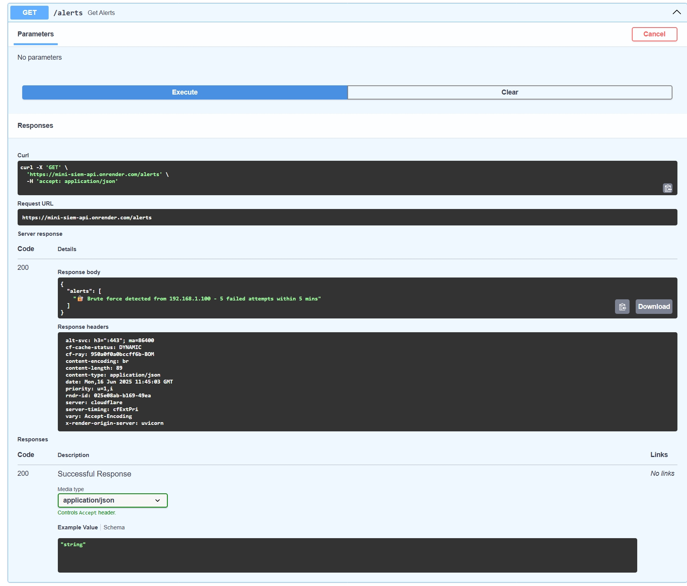
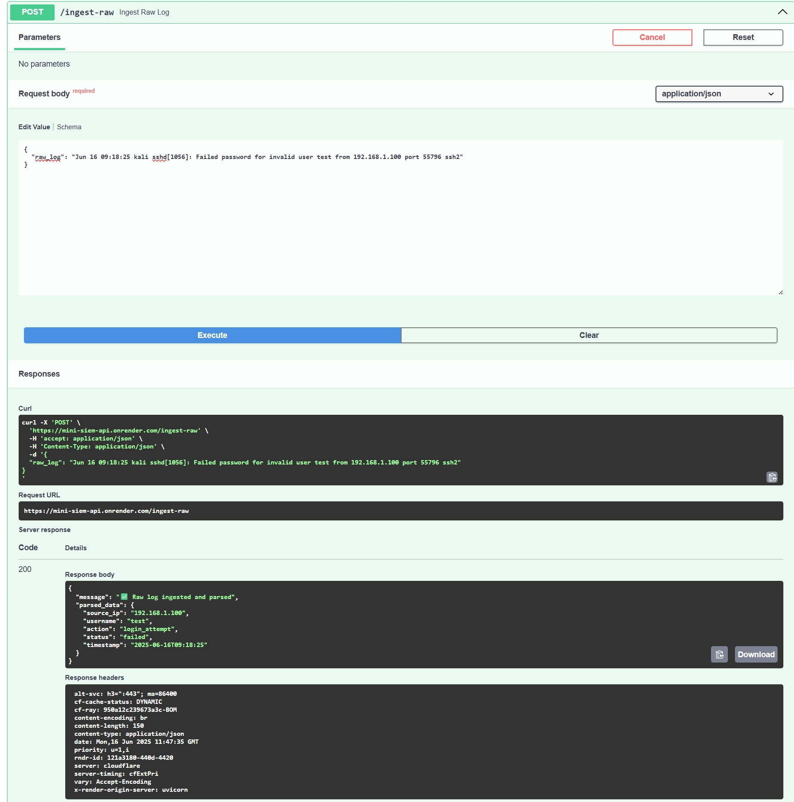
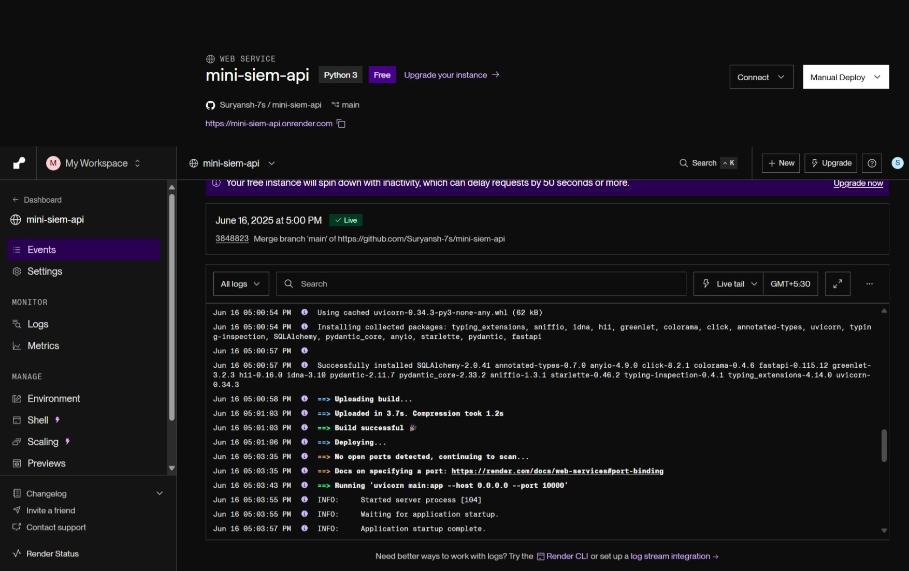

# Mini SIEM API 🛡️

A lightweight, deployable Security Information and Event Management (SIEM) system built with FastAPI. This project accepts system logs (both structured and raw), parses and stores them, and detects brute-force login attempts. It mimics the core functionality of enterprise SIEM tools in a simplified, developer-friendly way.

---

## 🔄 Live Demo

You can access and test the API here:

- Swagger UI: [https://mini-siem-api.onrender.com/docs](https://mini-siem-api.onrender.com/docs)
- ReDoc: [https://mini-siem-api.onrender.com/redoc](https://mini-siem-api.onrender.com/redoc)

---

## 🔧 Features

- `/ingest`: Accepts clean JSON logs and stores them.
- `/ingest-raw`: Accepts raw unstructured log lines (like from `/var/log/auth.log`) and parses them.
- `/alerts`: Applies detection rules (currently brute-force login) and returns triggered alerts.
- SQLite storage using SQLAlchemy.
- Fully documented via Swagger UI.

---

## 🌐 Use Case

This API can be used as a base for:
- Building a custom SIEM system.
- Demonstrating how log ingestion and correlation rules work.
- Practicing log parsing and cybersecurity event detection.
- Monitoring SSH login attempts on Linux systems.

---

## 🧱 Sample Usage

### 1. Ingest structured log (JSON)
```json
POST /ingest
{
  "source_ip": "192.168.1.100",
  "username": "admin",
  "action": "login_attempt",
  "status": "failed",
  "timestamp": "2025-06-16T12:00:00"
}
```

### 2. Ingest raw Linux auth log
```json
POST /ingest-raw
{
  "raw_log": "Jun 16 09:18:25 kali sshd[1056]: Failed password for invalid user test from 192.168.1.100 port 55796 ssh2"
}
```

### 3. Get current alerts
```http
GET /alerts
```

Returns:
```json
{
  "alerts": [
    "🔐 Brute force detected from 192.168.1.100 - 5 failed attempts within 5 mins"
  ]
}
```

---

## 🏆 Technologies Used

- Python 3.11+
- FastAPI
- Uvicorn
- SQLAlchemy
- Pydantic
- Regex-based log parsing

---

## 📍 Project Structure

```
mini-siem-api/
├── main.py          # FastAPI app
├── models.py        # SQLAlchemy DB models
├── database.py      # DB setup
├── rules.py         # Detection logic (brute-force)
├── parser.py        # Log line parser
├── schemas.py       # Pydantic models
├── requirements.txt
├── render.yaml      # Deployment config
└── README.md
```

---

## 🚷 Future Enhancements

- Add more detection rules (e.g. unusual login times, privilege escalation)
- Filebeat/rsyslog integration for live log streaming
- Streamlit or React-based frontend dashboard
- Alert forwarding to email or Slack
- JWT or API Key authentication

---

## 🚀 Getting Started Locally

1. Clone this repo
```bash
git clone https://github.com/Suryansh-7s/mini-siem-api.git
cd mini-siem-api
```

2. Create a virtual environment
```bash
python -m venv venv
.\venv\Scripts\Activate.ps1
```

3. Install dependencies
```bash
pip install -r requirements.txt
```

4. Run the app
```bash
uvicorn main:app --reload
```

---

## 📸 Screenshots

### 1. API Documentation (Swagger UI)


### 2. Ingesting a Structured Log (/ingest)


### 3. Alert Detection (/alerts)


### 4. Parsing a Raw Log (/ingest-raw)


### 5. Render Deployment Logs


---

## 🙌 Author

Made with passion for security and backend systems by Suryansh Sharma  
Feel free to connect on [LinkedIn](https://www.linkedin.com/in/suryansh-sharmaseven/) or raise an issue or PR.

---

🌟 If you found this project useful or interesting, consider starring the repo! 💫
